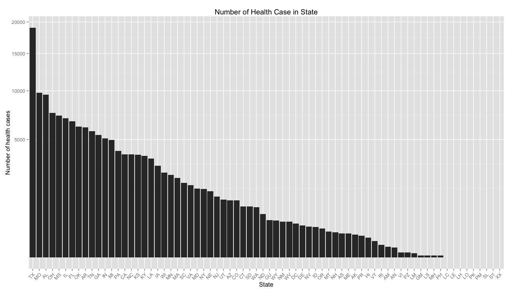

# Evaluation Of Severe Weather Events And Their Consequences On Human Health and Economy
Jiqing Huang  

### 1. Synopsis
In US, storm and other weather events cause a large loss for both population health and economy every year.In order to reduce the loss and damage from these disaster, it is important to find out which of them are the most harmful. History information including time and geography data for each weather event occurrence data were collected by U.S. National Oceanic and Atmospheric Administration’s (NOAA) storm database. In this paper, the database was downloaded and analysed to answer two question:

* Across the United States, which types of events (as indicated in the `EVTYPE` variable) are most harmful with respect to population health?

* Across the United States, which types of events have the greatest economic consequences?

### 2. Data Processing
#### 2.1 Reading the data
To conduct the analysis we used publicly available data coming from U.S. National Oceanic and Atmospheric Administration’s [storm data base](https://d396qusza40orc.cloudfront.net/repdata%2Fdata%2FStormData.csv.bz2), which can be downloaded from coursera web page, and download the data requires some time so I provide the comment code instead.


```r
# URL <- 'https://d396qusza40orc.cloudfront.net/repdata%2Fdata%2FStormData.csv.bz2'
# download.file(URL, destfile = "repdata-data-StormData.csv.bz2", method = "curl")
```
Then read the data and cache the computation


```r
dat <- read.table('repdata-data-StormData.csv.bz2', header = T, sep = ",", stringsAsFactors=FALSE)
dim(dat)
```

```
## [1] 902297     37
```

```r
str(dat)
```

```
## 'data.frame':	902297 obs. of  37 variables:
##  $ STATE__   : num  1 1 1 1 1 1 1 1 1 1 ...
##  $ BGN_DATE  : chr  "4/18/1950 0:00:00" "4/18/1950 0:00:00" "2/20/1951 0:00:00" "6/8/1951 0:00:00" ...
##  $ BGN_TIME  : chr  "0130" "0145" "1600" "0900" ...
##  $ TIME_ZONE : chr  "CST" "CST" "CST" "CST" ...
##  $ COUNTY    : num  97 3 57 89 43 77 9 123 125 57 ...
##  $ COUNTYNAME: chr  "MOBILE" "BALDWIN" "FAYETTE" "MADISON" ...
##  $ STATE     : chr  "AL" "AL" "AL" "AL" ...
##  $ EVTYPE    : chr  "TORNADO" "TORNADO" "TORNADO" "TORNADO" ...
##  $ BGN_RANGE : num  0 0 0 0 0 0 0 0 0 0 ...
##  $ BGN_AZI   : chr  "" "" "" "" ...
##  $ BGN_LOCATI: chr  "" "" "" "" ...
##  $ END_DATE  : chr  "" "" "" "" ...
##  $ END_TIME  : chr  "" "" "" "" ...
##  $ COUNTY_END: num  0 0 0 0 0 0 0 0 0 0 ...
##  $ COUNTYENDN: logi  NA NA NA NA NA NA ...
##  $ END_RANGE : num  0 0 0 0 0 0 0 0 0 0 ...
##  $ END_AZI   : chr  "" "" "" "" ...
##  $ END_LOCATI: chr  "" "" "" "" ...
##  $ LENGTH    : num  14 2 0.1 0 0 1.5 1.5 0 3.3 2.3 ...
##  $ WIDTH     : num  100 150 123 100 150 177 33 33 100 100 ...
##  $ F         : int  3 2 2 2 2 2 2 1 3 3 ...
##  $ MAG       : num  0 0 0 0 0 0 0 0 0 0 ...
##  $ FATALITIES: num  0 0 0 0 0 0 0 0 1 0 ...
##  $ INJURIES  : num  15 0 2 2 2 6 1 0 14 0 ...
##  $ PROPDMG   : num  25 2.5 25 2.5 2.5 2.5 2.5 2.5 25 25 ...
##  $ PROPDMGEXP: chr  "K" "K" "K" "K" ...
##  $ CROPDMG   : num  0 0 0 0 0 0 0 0 0 0 ...
##  $ CROPDMGEXP: chr  "" "" "" "" ...
##  $ WFO       : chr  "" "" "" "" ...
##  $ STATEOFFIC: chr  "" "" "" "" ...
##  $ ZONENAMES : chr  "" "" "" "" ...
##  $ LATITUDE  : num  3040 3042 3340 3458 3412 ...
##  $ LONGITUDE : num  8812 8755 8742 8626 8642 ...
##  $ LATITUDE_E: num  3051 0 0 0 0 ...
##  $ LONGITUDE_: num  8806 0 0 0 0 ...
##  $ REMARKS   : chr  "" "" "" "" ...
##  $ REFNUM    : num  1 2 3 4 5 6 7 8 9 10 ...
```
#### 2.2 Cleaning the data
Next, We need to gather the same event toghter in `EVTYPE`, to consolidate major categories of events.

```r
length(unique(dat$EVTYPE))
```

```
## [1] 985
```

```r
head(unique(dat$EVTYPE), 20)
```

```
##  [1] "TORNADO"                   "TSTM WIND"                
##  [3] "HAIL"                      "FREEZING RAIN"            
##  [5] "SNOW"                      "ICE STORM/FLASH FLOOD"    
##  [7] "SNOW/ICE"                  "WINTER STORM"             
##  [9] "HURRICANE OPAL/HIGH WINDS" "THUNDERSTORM WINDS"       
## [11] "RECORD COLD"               "HURRICANE ERIN"           
## [13] "HURRICANE OPAL"            "HEAVY RAIN"               
## [15] "LIGHTNING"                 "THUNDERSTORM WIND"        
## [17] "DENSE FOG"                 "RIP CURRENT"              
## [19] "THUNDERSTORM WINS"         "FLASH FLOOD"
```
Then we do the recoding

```r
# Convert all names to lowercase
names(dat) <- tolower(names(dat))

# Convert evtype to lowercase
dat$evtype <- tolower(dat$evtype)

# Recode major categories of events into fewer groups
dat$evtype <- gsub("^.*(fire).*$", "fire", dat$evtype, ignore.case=TRUE)
dat$evtype <- gsub("^.*(flood).*$", "flood", dat$evtype, ignore.case=TRUE)
dat$evtype <- gsub("^.*(rain).*$", "rain", dat$evtype, ignore.case=TRUE)
dat$evtype <- gsub("^.*(precip).*$", "precipitation", dat$evtype, ignore.case=TRUE)
dat$evtype <- gsub("^.*(shower).*$", "rain", dat$evtype, ignore.case=TRUE)
dat$evtype <- gsub("^.*(hurricane).*$", "hurricane", dat$evtype, ignore.case=TRUE)
dat$evtype <- gsub("^.*(heat).*$", "heat", dat$evtype, ignore.case=TRUE)
dat$evtype <- gsub("^.*(hot).*$", "heat", dat$evtype, ignore.case=TRUE)
dat$evtype <- gsub("^.*(warm).*$", "heat", dat$evtype, ignore.case=TRUE)
dat$evtype <- gsub("^.*(wind).*$", "wind", dat$evtype, ignore.case=TRUE)
dat$evtype <- gsub("^.*(snow).*$", "snow", dat$evtype, ignore.case=TRUE)
dat$evtype <- gsub("^.*(blizzard).*$", "blizzard", dat$evtype, ignore.case=TRUE)
dat$evtype <- gsub("^.*(hail).*$", "hail", dat$evtype, ignore.case=TRUE)
dat$evtype <- gsub("^.*(ice).*$", "ice", dat$evtype, ignore.case=TRUE)
dat$evtype <- gsub("^.*(icy).*$", "ice", dat$evtype, ignore.case=TRUE)
dat$evtype <- gsub("^.*(sleet).*$", "sleet", dat$evtype, ignore.case=TRUE)
dat$evtype <- gsub("^.*(freez).*$", "freeze", dat$evtype, ignore.case=TRUE)
dat$evtype <- gsub("^.*(frost).*$", "frost", dat$evtype, ignore.case=TRUE)
dat$evtype <- gsub("^.*(thunderstorm).*$", "thunderstorm", dat$evtype, ignore.case=TRUE)
dat$evtype <- gsub("^.*(torn).*$", "tornado", dat$evtype, ignore.case=TRUE)
dat$evtype <- gsub("^.*(volcan).*$", "volcanic", dat$evtype, ignore.case=TRUE)
dat$evtype <- gsub("^.*(wint).*$", "winter weather", dat$evtype, ignore.case=TRUE)
dat$evtype <- gsub("^.*(cold).*$", "cold", dat$evtype, ignore.case=TRUE)
dat$evtype <- gsub("^.*(cool).*$", "cold", dat$evtype, ignore.case=TRUE)
dat$evtype <- gsub("^.*(dry).*$", "dry", dat$evtype, ignore.case=TRUE)
dat$evtype <- gsub("^.*(mud).*$", "mudslide", dat$evtype, ignore.case=TRUE)
dat$evtype <- gsub("^.*(spout).*$", "waterspout", dat$evtype, ignore.case=TRUE)
dat$evtype <- gsub("^.*(surf).*$", "surf", dat$evtype, ignore.case=TRUE)
dat$evtype <- gsub("^.*(waves).*$", "surf", dat$evtype, ignore.case=TRUE)
dat$evtype <- gsub("^.*(swell).*$", "surf", dat$evtype, ignore.case=TRUE)
dat$evtype <- gsub("^.*(lightning).*$", "lightning", dat$evtype, ignore.case=TRUE)
dat$evtype <- gsub("^.*(fog).*$", "fog", dat$evtype, ignore.case=TRUE)
dat$evtype <- gsub("^.*(dust).*$", "dust", dat$evtype, ignore.case=TRUE)
dat$evtype <- gsub("^.*(wet).*$", "wet", dat$evtype, ignore.case=TRUE)
dat$evtype <- gsub("^.*(summary).*$", NA, dat$evtype, ignore.case=TRUE)
```
After recoding, see how many events nows

```r
### after cleaning the same event
length(unique(dat$evtype))
```

```
## [1] 136
```

Take a look at the dataset, there are 4 columns are corresponding to health and economy loss:
    
* `fatalities` ~ The number of fatalities caused by the events
* `injuries` ~ number of people injured by the events
* `propdmg` ~ The amount of property loss by the events
* `cropdmg` ~ The amount of crop damage by the weather


### 3. Data Analysis
#### 3.1 The most harmful events for public health
To discover what kind of weather effects are most harmful with respect to U.S. population health we’ve focused our research on 2 main variables: number of injuries (`injuries`) and number of fatalities (`fatalities`). To estimate total impact on health we’ve introduced `total` variable, being the sum of injuries and fatalities.

```r
library(plyr)
fatalities <- ddply(dat, "evtype", summarise, fatalilities.No. = sum(fatalities) )
dim(fatalities)
```

```
## [1] 136   2
```

```r
injuries <- ddply(dat, "evtype", summarise, injuries.No. = sum(injuries) )
dim(injuries)
```

```
## [1] 136   2
```

```r
health <- merge(fatalities, injuries, by="evtype")
### create the total of fatalities and health
health[,4] <- health[,2] + health[,3]
colnames(health) <- c("type", "fatalities", "injuries", "total")
### take the top 10 health threat event
Top10 <- health[order(health$total, decreasing=TRUE),][1:10,]
Top10
```

```
##               type fatalities injuries total
## 106        tornado       5636    91407 97043
## 133           wind       1448    11498 12946
## 42            heat       3178     9243 12421
## 29           flood       1525     8604 10129
## 60       lightning        817     5231  6048
## 54             ice        102     2183  2285
## 134 winter weather        278     1953  2231
## 27            fire         90     1608  1698
## 50       hurricane        135     1328  1463
## 41            hail         15     1371  1386
```
Now start the top 10 threat event plot, and we need to `melt` the data by the types `fatalities`, `injuries`, and `total`.

```r
### start plot
library(reshape2)
Top10 <- melt(Top10, id.vars="type")
dim(Top10)
```

```
## [1] 30  3
```

```r
str(Top10)
```

```
## 'data.frame':	30 obs. of  3 variables:
##  $ type    : chr  "tornado" "wind" "heat" "flood" ...
##  $ variable: Factor w/ 3 levels "fatalities","injuries",..: 1 1 1 1 1 1 1 1 1 1 ...
##  $ value   : num  5636 1448 3178 1525 817 ...
```

```r
library(ggplot2)
ggplot(Top10, aes(x = reorder(type, -value), y = value)) + 
  geom_bar(stat = "identity", aes(fill = variable), position = "dodge") + 
  scale_y_sqrt("Number of Cases") + xlab("Event Type") +
  theme(axis.text.x = element_text(angle = 45, hjust=1)) + 
  ggtitle("Top 10 Health Threat Events")
```


#### 3.2 The most harmful events for economy
We know the `propdmg` and `cropdmg` means the dollars lost for the property damage and crop damage, but they are in different units (`propdmgexp` and `cropdmgexp`) in original data, and we can check them by following code.

```r
unique(dat$propdmgexp)
```

```
##  [1] "K" "M" ""  "B" "m" "+" "0" "5" "6" "?" "4" "2" "3" "h" "7" "H" "-"
## [18] "1" "8"
```

```r
unique(dat$cropdmgexp)
```

```
## [1] ""  "M" "K" "m" "B" "?" "0" "k" "2"
```
According to the [National Weather Service Storm Data Documentation](https://d396qusza40orc.cloudfront.net/repdata%2Fpeer2_doc%2Fpd01016005curr.pdf):

+ “K”/ “k” stand for thousand
+ “M”/ “m” stand for million
+ “B”/ “b” stand for billion

Thus we first subset a `economy` data and tranform them as the same unit for property and crop.

```r
economy <- dat[ , c("evtype", "propdmg", "propdmgexp", "cropdmg", "cropdmgexp")]
### make the property unit the same
index1 <- which(economy$propdmgexp %in% c("K","k"))
index2 <- which(economy$propdmgexp %in% c("M","m"))
index3 <- which(economy$propdmgexp %in% c("B","b"))
economy[,"propdmg"][index1] <- economy[,"propdmg"][index1]*(10^3)
economy[,"propdmg"][index2] <- economy[,"propdmg"][index2]*(10^6)
economy[,"propdmg"][index3] <- economy[,"propdmg"][index3]*(10^9)
#### same for the crop
index4 <- which(economy$cropdmgexp %in% c("K","k"))
index5 <- which(economy$cropdmgexp %in% c("M","m"))
index6 <- which(economy$cropdmgexp %in% c("B","b"))
economy[,"cropdmg"][index4] <- economy[,"cropdmg"][index4]*(10^3)
economy[,"cropdmg"][index5] <- economy[,"cropdmg"][index5]*(10^6)
economy[,"cropdmg"][index6] <- economy[,"cropdmg"][index6]*(10^9)
```
Then we use `ddply` to summarise the total dollars lost of each threat event for propert and crop damage, and find the top 10 threat event.

```r
property <- ddply(economy, "evtype", summarise, property = sum(propdmg) )
crop <- ddply(economy, "evtype", summarise, crop = sum(cropdmg) )
### take the top 10 health threat event
property.Top10 <- property[order(property$property, decreasing = TRUE),   ][1:10, ]
crop.Top10 <- crop[order(crop$crop, decreasing = TRUE),   ][1:10, ]
head(property.Top10)
```

```
##          evtype  property
## 29        flood 1.675e+11
## 50    hurricane 8.476e+10
## 106     tornado 5.699e+10
## 101 storm surge 4.332e+10
## 133        wind 1.763e+10
## 41         hail 1.597e+10
```

```r
head(crop.Top10)
```

```
##        evtype      crop
## 22    drought 1.397e+10
## 29      flood 1.238e+10
## 50  hurricane 5.515e+09
## 54        ice 5.022e+09
## 41       hail 3.047e+09
## 133      wind 2.036e+09
```
Then we start to plot

```r
library(gridExtra)
```

```
## Loading required package: grid
```

```r
plot1 <- ggplot(property.Top10, aes(x = reorder(evtype, -property), y = property)) + 
  geom_bar(stat = "identity", position = "dodge", color = "indianred1", fill = "lightblue") + 
  scale_y_sqrt("Property Damage(US Dollar)") + xlab("Event Type") +
  theme(axis.text.x = element_text(angle = 45, hjust=1)) + 
  ggtitle("Top 10 Property Threat Events")

plot2 <- ggplot(crop.Top10, aes(x = reorder(evtype, -crop), y = crop)) + 
  geom_bar(stat = "identity", position = "dodge", color = "indianred1", fill = "lightgreen") + 
  scale_y_sqrt("Property Damage(US Dollar)") + xlab("Event Type") +
  theme(axis.text.x = element_text(angle = 45, hjust=1)) + 
  ggtitle("Top 10 Crop Threat Events")

grid.arrange(plot1, plot2, ncol = 1)
```


#### 3.3 Which part of US suffer most from the weather disaster?
create a dataframe `US.state` to show number of health threaten cases by state.

```r
US.state <- dat[,c("state", "fatalities", "injuries")]
### columnwise addition for sub-total 
US.state$subtotal <- US.state$fatalities + US.state$injuries
### find the total event for eah state
US.state_total <- ddply(US.state, 'state', summarise, total = sum(subtotal))
head(US.state_total)
```

```
##   state total
## 1    AK   186
## 2    AL  9526
## 3    AM    40
## 4    AN    35
## 5    AR  6080
## 6    AS   205
```
then start plot

```r
ggplot(US.state_total, aes(x = reorder(state, -total), y = total)) + 
  geom_bar(stat = "identity", position = "dodge") + 
  scale_y_sqrt("Number of health cases") + xlab("State") +
  theme(axis.text.x = element_text(hjust=1, angle = 45)) + 
  ggtitle("Number of Health Case in State")
```



### 4. Result
The key findings:

> * Top 3 dangerous weather disaster for **public health**: <span style="color:red">_tornado_,  _wind_,   _heat_</span>.
> * Top 3 dangerous weather disaster for property loss (**economy**): <span style="color:blue">_flood_,  _hurricane_,  _tornado_</span>.
> * Top 3 dangerous weather disaster for crop damage (**economy**): <span style="color:green">_drought_,  _flood_,  _hurricane_</span>.

Finally, **Texas** is the most vulnerable targets for bad weather events.
